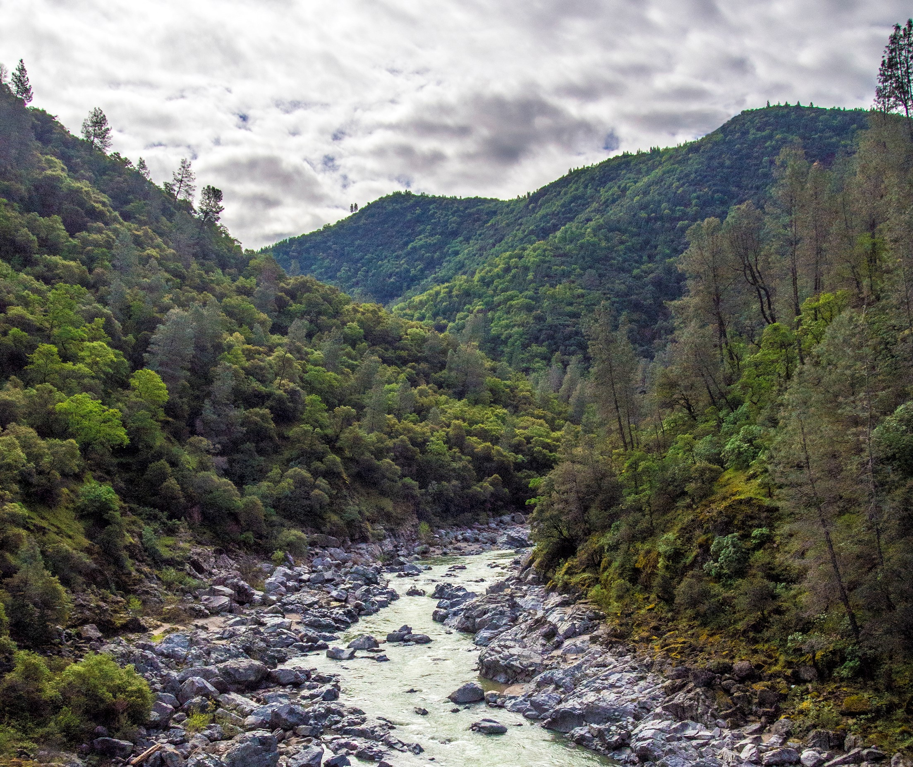

```{r setup, include=FALSE}
knitr::opts_chunk$set(echo = FALSE)
```



As part of a team of five for our master's capstone project, identified three priority watersheds for prescribed fire in the Central Sierra Nevada for prescribed fire to minimize the water quality impacts of high severity wildfire for our client, American Rivers. 

Learn more at <https://www.forests2faucets.com/>.


