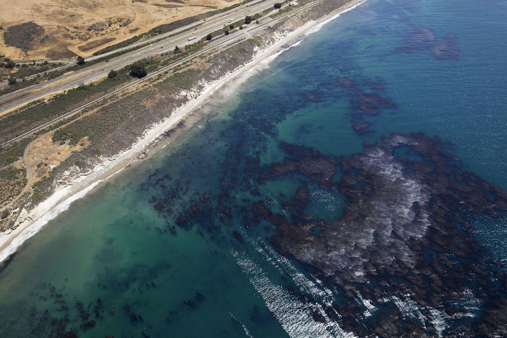

```{r setup, include=FALSE}
knitr::opts_chunk$set(echo = FALSE)

# Load libraries
library(tidyverse)
library(here)
library(sf)
library(tmap)
library(janitor)
```



## Source
California Office of Spill Prevention and Response (OSPR).2009. Oil Spill Tracking Database - 2008. Accessed at: [BIOS](https://map.dfg.ca.gov/metadata/ds0394.html).

## Analysis

### Step 1: Read in data

```{r}
# Read is oil spill & county data
oil_spills <- read_sf(here("_posts",
                           "2021-02-23-mapping-oil-spills-in-r",
                           "ds394",
                           "ds394.shp")) %>% 
  clean_names()

ca_counties <- read_sf(here("_posts",
                           "2021-02-23-mapping-oil-spills-in-r",
                           "ca_counties", 
                           "CA_Counties_TIGER2016.shp")) %>% 
  clean_names()

```

### Step 2: Conduct data wrangling

```{r}

## Check crs
# ca_counties %>% st_crs()
# oil_spills %>% st_crs()

# Clean county data for simple use
counties_clean <- ca_counties %>% 
  select(name, aland) %>% 
  rename(county_name = name, 
         land_area = aland)

# Clean oil psill data
oil_spills_clean <- oil_spills %>% 
  st_transform(3857) %>% 
  rename(City = localecity)

# Spatial join counties with oil spills
ca_oilspills <- counties_clean %>% 
  st_join(oil_spills_clean) %>% 
  count(county_name)

```

### Step 3: Create interactive map of oil spills

```{r, results = TRUE, fig.align = 'center'}
# Create interactive map

tmap_mode(mode = "view")

tm_shape(oil_spills) +
  tm_dots(col = "specificlo",
          alpha = 0.5,
          title ="Location of Spill",
          id = "dateofinci",
          popup.vars=c("localecity"))

```

<font size="2"> ***Figure 1: Interactive map of oil spills in California, 2008. Color indicates what land form the spill took place in. Hover over a point to learn the date of the spill.***</font>


