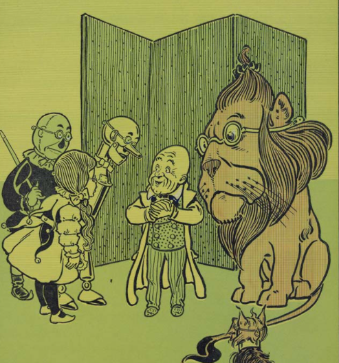

```{r setup, include=FALSE}
knitr::opts_chunk$set(echo = FALSE)

library(tidyverse)
library(tidytext)
library(here)
library(textdata)
library(pdftools)
library(ggwordcloud)
library(viridis)
```


## Source
Baum, L. Frank. 1900. The Wonderful Wizard of Oz. Chicago ; New York : G.M. Hill Co. Accessed at: [The Internet Archive](https://archive.org/details/wonderfulwizardo00baumiala/mode/2up).

## Analysis

### Step 1: Read in pdf

```{r, cache=TRUE}
oz <- pdf_text("wonderfulwizard.pdf")

```

### Step 2: Make text tidy

```{r}
oz_tidy <- data.frame(oz) %>% 
  mutate(text_full = str_split(oz, pattern = '\\n')) %>% 
  unnest(text_full) %>% 
  mutate(text_full = str_squish(text_full)) %>% 
  mutate(text_full = str_to_lower(text_full)) %>% 
  slice(-(1:105))

```

### Step 3: Convert text to tokens
```{r}
oz_tokens <- oz_tidy %>% 
  unnest_tokens(word, text_full) %>% 
  dplyr::select(-oz)


```

### Step 4: Count the most frequent words in Oz & visualize
```{r, fig.align='center'}
# Remove all stop_words
oz_nonstop_words <- oz_tokens %>% 
  anti_join(stop_words)

# Count all non-stop words
oz_wordcount <- oz_nonstop_words %>% 
  count(word)

# Segment top 10
top_10_words <- oz_wordcount %>% 
  arrange(-n) %>% 
  slice(1:10)

# visualize top 10
plot <- ggplot(data = top_10_words, aes(x = reorder(word, -n), y = n, fill = reorder(word, -n))) +
  geom_col() +
  coord_flip() + 
  theme_minimal() +
  labs(x = "", y = "Count") +
  scale_fill_viridis_d() +
  theme(legend.position = "none")
  
```

## Vizualize

```{r}

plot

```


