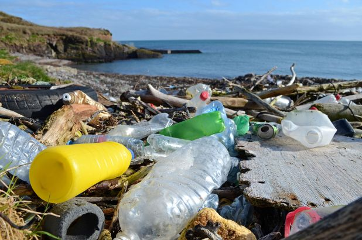

```{r setup, include=FALSE}
knitr::opts_chunk$set(echo = FALSE)

library(tidyverse)
library(tidytuesdayR)
library(ggforce)
```




## Source

Break Free from Plastic. 2021. Break Free From Plastic Brand Audit. Accessed at: [Tidy Tuesday GitHub](https://github.com/rfordatascience/tidytuesday/blob/master/data/2021/2021-01-26/readme.md).

## Analysis

### Step 1: Read in data
```{r, message = FALSE, warning=FALSE, results='hide'}
# Read in data
tuesdata <- tidytuesdayR::tt_load(2021, week = 5)
plastics <- tuesdata$plastics
```

### Step 2: Wrangle and subset the data
```{r}
# wrangle the data to isolate Ireland and summarize results for percent of plastics reported with no known brand in 2020
ireland <- plastics %>% 
  filter(country == 'Ireland') %>% 
  select(country, year, parent_company, hdpe:pvc) %>% 
  pivot_longer(cols = hdpe:pvc, 
               names_to = "plastic_type", 
               values_to = "number_of_items") %>% 
  group_by(country, year, parent_company, plastic_type) %>% 
  summarise(number_of_items = sum(number_of_items, na.rm = T)) %>% 
  filter(year == 2020 & parent_company != "Grand Total") %>% 
  mutate(is_known = case_when(parent_company %in% 
                                c("Unbranded", 
                                  "null", 
                                  "NULL", 
                                  "see excel file") ~ "unknown",
                              TRUE ~ "known")) %>% 
  ungroup() %>% 
  select(country, is_known, number_of_items) %>% 
  group_by(country, is_known) %>% 
  summarize(number_of_items = sum(number_of_items)) %>% 
  mutate(proportion_unknown = round(number_of_items/sum(number_of_items), 2))
```

### Step 3: Create elements of bottle plot
```{r}
# Make body of bottle
 bottle <- tribble(
        ~id, ~x, ~y,
        #############
        1.1, 1, 1, 
        1.2, 1.5, 1, 
        1.3, 1.5, 2,
        1.4, 1, 2,
    )

# Make cap of bottle
    top <- tribble(
        ~id, ~x, ~y,
        ############
        2.1, 1.15, 2,
        2.2, 1.15, 2.1,
        2.3, 1.35, 2.1,
        2.4, 1.35, 2
    )

# Pull percent unknown  
percent_value <- ireland %>% 
  filter(is_known == 'unknown') %>% 
  pull(proportion_unknown)

# The main shape for the country "fill"
country_tab <- tribble(
    ~id, ~x, ~y,
    #############
    1.1, 1, 1, 
    1.2, 1.5, 1, 
    1.3, 1.5, 2 - (1 - percent_value),
    1.4, 1, 2 - (1 - percent_value)
  )
    
# An added rectangle to square the top of the main shape
country_tab_extra <- tribble(
    ~id, ~x, ~y,
    #############
    1.1, 1, 1.3, 
    1.2, 1.5, 1.3, 
    1.3, 1.5, 2 - (1 - percent_value),
    1.4, 1, 2 - (1 - percent_value),
  )

```

### Step 4: Vizualize the results
```{r}
# Make a plot
ggplot() +
geom_shape(data = country_tab, 
           aes(x = x, y = y), 
           fill = "#8ecae6",
           expand = unit(-2, 'mm'), 
           radius = unit(17.5, 'mm')) +
geom_shape(data = country_tab_extra, 
           aes(x = x, y = y), 
           fill = "#8ecae6",
           expand = unit(-2, 'mm'), 
           radius = unit(1, 'mm')) +
geom_shape(data = bottle, 
             aes(x = x, y = y),
             fill = NA,
             col = "black",
             expand = unit(-2, 'mm'),
             radius = unit(17.5, 'mm'),
             size = 1.5) +
geom_shape(data = top,
             aes(x = x, y = y),
             fill = NA,
             col = "black",
             radius = unit(3, 'mm'),
             size = 1.5
             ) +
theme_void() + 
scale_x_continuous(limits = c(0,2)) +
 annotate("text", x = 1.25, y = 1.3, 
          label = paste0(round(percent_value, 2) * 100, "%"),
          size = 6, 
          col = "black") +
 annotate("text", x = 1.25, y = 1.5, 
          label = 'Ireland',
          size = 8, 
          col = "black")
```


