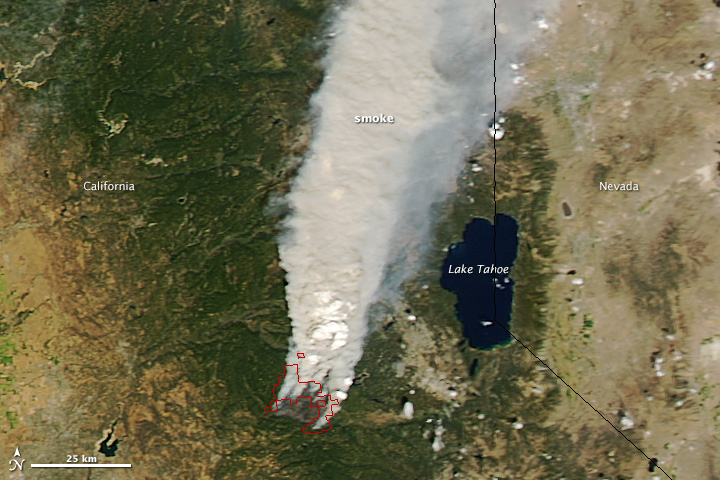

```{r setup, include=FALSE}
knitr::opts_chunk$set(echo = FALSE)

library(tidyverse)
library(sf)
library(here)
library(janitor)
library(lubridate)
library(shiny)

```



## Source
CalFire. 2020. Fire perimeters for California. Accessed at: [Fire and Resource Assessment Program](https://map.dfg.ca.gov/metadata/ds0396.html).

## Analysis

### Step 1: Read in data
```{r}
# Read in data file & summarize
fire_hist <- read_sf(here("_posts", "2021-03-15-interactivity-in-r-fire-history","FireHist_CABY","FireHist_CABY.shp")) %>%
  as.data.frame() %>%
  clean_names() %>%
  mutate(year = lubridate::year(alarm_date)) %>%
  dplyr::select(year, gis_acres) %>%
  group_by(year) %>%
  summarize(sum = sum(gis_acres))
```

### Step 2: Highlight King Fire
```{r}
fire_subset <- fire_hist %>%
  mutate(highlight = ifelse(year %in% 2014, "yes", "no"))

```


### Step 3: Visualize results
```{r}
ggplot(data = fire_subset, 
         aes(x = year, y = sum, fill = highlight)) +
    geom_col() +
    scale_fill_manual(values = c("yes"="tomato", "no" ="gray"), guide = FALSE) +
    labs( x = "Year",
          y = "Total Area Burned (ac)") +
    theme_minimal() +
    scale_x_continuous(expand = c(0,0),
                       breaks = seq(2000, 2020, by = 2)) +
    scale_y_continuous(expand = c(0,0))
    
```

